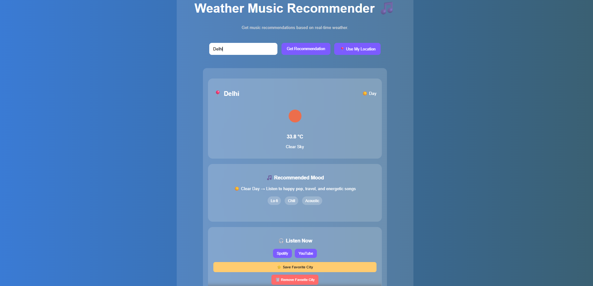
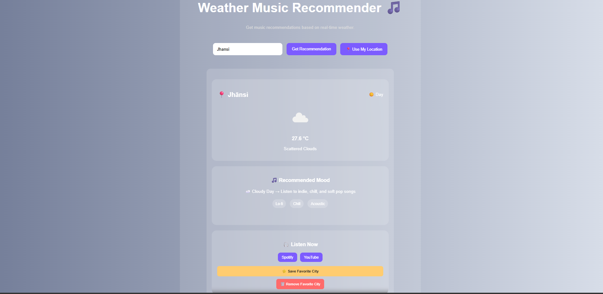
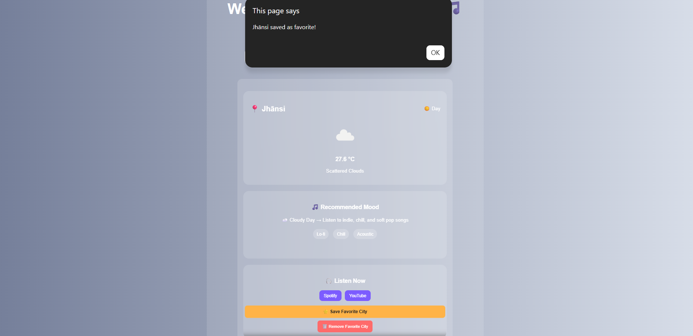
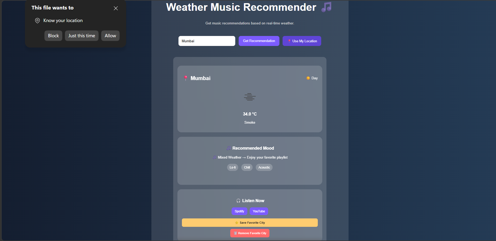

# Weather Music Recommender 🎵☀️

A web application that recommends music based on real-time weather conditions. The app fetches live weather data using the OpenWeather API and suggests suitable music playlists according to the current weather and time of day.

## Live Demo

🔗 Live Project: https://prashastimathur02-glitch.github.io/weather-music-recommender/

## Features

* 🌤️ Real-time weather data using OpenWeather API
* 🌙 Day/Night detection
* 🎵 Weather-based music recommendations
* 🎧 Spotify playlist integration
* ▶️ YouTube playlist integration
* 🎨 Dynamic weather backgrounds
* 🌦️ Weather icons
* ⭐ Save favorite city using Local Storage
* 🗑️ Remove favorite city
* ⌨️ Enter key support for quick search
* 📍 Current location weather using Geolocation API
* 📱 Responsive and modern UI

## Technologies Used

* HTML
* CSS
* JavaScript
* OpenWeather API
* Browser Local Storage
* Geolocation API

## How to Use

1. Enter a city name and click **Get Recommendation**.
2. Or click **Use My Location** to get weather data automatically.
3. View current weather information and recommended music.
4. Open Spotify or YouTube playlists directly.
5. Save your favorite city for future visits.

## Screenshots
### Home Screen

### Weather Recommendation

### Weather Recommendation for Another City

### Save Favorite City

### Use Current Location

## Future Improvements

* Deploy the project using GitHub Pages
* Deploy the project on AWS EC2
* Add 5-day weather forecast recommendations
* Add recent search history
* Add animated weather backgrounds
* Integrate Spotify API for actual playlists
* Add mood-based recommendations
* Improve mobile responsiveness
* Add dark/light mode toggle

## Author

Prashasti Mathur
