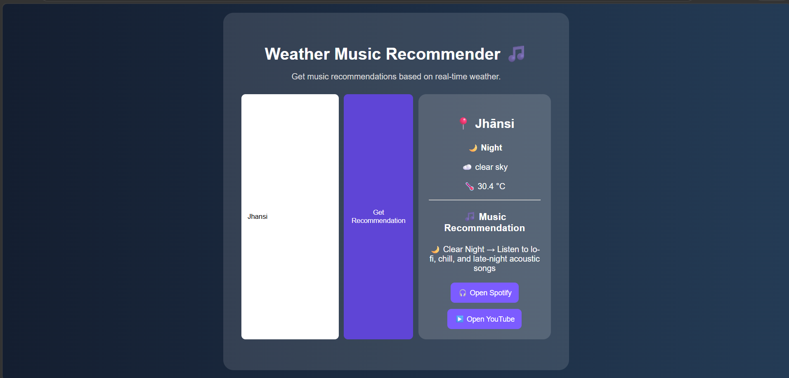

# Weather Music Recommender 🎵

A web application that recommends music based on real-time weather conditions using the OpenWeather API.
 ## Features
- Real-time weather data using OpenWeather API
- Weather-based music recommendations
- Day and Night detection
- Dynamic weather backgrounds
- Spotify playlist integration
- YouTube playlist integration
- Responsive user interface

## Technologies Used
- HTML
- CSS
- JavaScript
- OpenWeather API

## Future Improvements
- Day/Night detection
- Dynamic backgrounds
- Weather icons
- Spotify/YouTube playlist integration
- AWS deployment
- 
## Screenshots
### Example 1 - Delhi

###  Example 2-Jhansi

### Example 3-Hyderabad

### Example 4-Bhopal

### Example 5-Osaka

## Author
Prashasti Mathur
